  <a href="https://vamsi3.com"><picture><source media="(prefers-color-scheme: dark)" srcset="https://img.shields.io/badge/vamsi3.com-1a1b27?style=for-the-badge&logo=safari&logoColor=white"></picture></a>&nbsp;
  <a href="https://vamsi3.com/app/digital-garden"><picture><source media="(prefers-color-scheme: dark)" srcset="https://img.shields.io/badge/🌱_digital_garden-1a1b27?style=for-the-badge"></picture></a>&nbsp;
  <a href="https://vamsi3.com/app/bento"><picture><source media="(prefers-color-scheme: dark)" srcset="https://img.shields.io/badge/🍱_bento-1a1b27?style=for-the-badge"></picture></a>&nbsp;
  <a href="https://linkedin.com/in/vamsi3"><picture><source media="(prefers-color-scheme: dark)" srcset="https://img.shields.io/badge/linkedin-1a1b27?style=for-the-badge&logo=linkedin&logoColor=white"></picture></a>&nbsp;

---

Engineer at Google DeepMind, previously at Samsung HQ. I build tools I wish existed, then spend twice as long customizing them. Every "quick weekend hack" has a suspicious tendency to become a full-blown project with its own roadmap.

**Things I have worked with** 
<picture><source media="(prefers-color-scheme: dark)" srcset="https://img.shields.io/badge/Svelte-1a1b27?style=flat&logo=svelte&logoColor=FF3E00"></picture>
<picture><source media="(prefers-color-scheme: dark)" srcset="https://img.shields.io/badge/Swift-1a1b27?style=flat&logo=swift&logoColor=F05138"></picture>
<picture><source media="(prefers-color-scheme: dark)" srcset="https://img.shields.io/badge/Python-1a1b27?style=flat&logo=python&logoColor=3776AB"></picture>
<picture><source media="(prefers-color-scheme: dark)" srcset="https://img.shields.io/badge/TypeScript-1a1b27?style=flat&logo=typescript&logoColor=3178C6"></picture>
<picture><source media="(prefers-color-scheme: dark)" srcset="https://img.shields.io/badge/Nix-1a1b27?style=flat&logo=nixos&logoColor=5277C3"></picture>
<picture><source media="(prefers-color-scheme: dark)" srcset="https://img.shields.io/badge/C++-1a1b27?style=flat&logo=cplusplus&logoColor=00599C"></picture>
<picture><source media="(prefers-color-scheme: dark)" srcset="https://img.shields.io/badge/Kotlin-1a1b27?style=flat&logo=kotlin&logoColor=7F52FF"></picture>
<picture><source media="(prefers-color-scheme: dark)" srcset="https://img.shields.io/badge/Rust-1a1b27?style=flat&logo=rust&logoColor=white"></picture>
<picture><source media="(prefers-color-scheme: dark)" srcset="https://img.shields.io/badge/...and_more-1a1b27?style=flat"></picture>

**I like math & puzzles** 
<a href="https://icpc.global/ICPCID/0M6DXX1D30Y4"><picture><source media="(prefers-color-scheme: dark)" srcset="https://img.shields.io/badge/ICPC-1a1b27?style=flat&logoColor=white"></picture></a>
<a href="https://codeforces.com/profile/vamsi3"><picture><source media="(prefers-color-scheme: dark)" srcset="https://img.shields.io/badge/Codeforces-1a1b27?style=flat&logo=codeforces&logoColor=1F8ACB"></picture></a>
<a href="https://projecteuler.net/profile/vamsi3.png"><picture><source media="(prefers-color-scheme: dark)" srcset="https://img.shields.io/badge/Project_Euler-1a1b27?style=flat"></picture></a>

psst — try toggling your theme ✨
